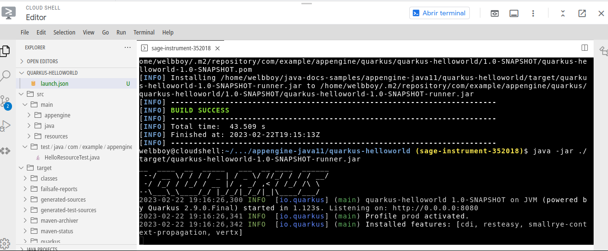

# GCP-Cloudshell

Desafio utilizando conhecimentos dos cursos anteriores com o Cloud Shell e o git do google.
1 - Na plataform do Google, utilizando o Cloud Shell fizemos o clone do repositório de exemplos do Google Cloud Plataform.

2 - Depois fizemos o build da aplicação Quarkus-helloworld.

3- Acesso liberado na porta 8080 local.

Build da aplicação pelo Cloud Shell:

  

Aplicação sendo executada pelo terminal Cloud Shell:

  

Aplicação

  

